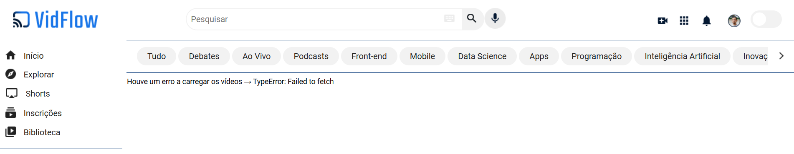

# VidFlow

[](https://www.linkedin.com/in/oliwerb/) 
[](mailto:olwrrb@protonmail.com") 
[](mailto:benites.olivr@gmail.com.com")

Projeto desenvolvido durante o curso de consumo de API e tratamento de dados no programa Desenvolve, projeto promovido pelo Grupo Boticário e a escola Alura. O objetivo foi adicionar e consumir uma API fake que alimenta o VidFlow com os vídeos (urls, títulos, descrições, etc).

A barra de pesquisa e os botões de categoria também estão funcionais, podendo pesquisar e filtrar entre os vídeos enviados pela API fake.

### Tecnologias


## Como Executar

Caso o código seja executado sem seguir os seguintes passos, ao invés dos vídeos irá aparecer uma mensagem do tratamento de erro:



Para que ele seja executado da forma esperada, é necessário rodar a API fake.

**1. Instalar o Node.js**

A versão do Node.js utilizada nesse projeto foi a v20.11.0.

**2. Instalar o JSON Server**

- No terminal ou prompt de comando
- Para instalar globalmente, é necessário digitar este comando:

```shell
npm install -g json-server
```

**3. Permitir a Política de Execução de Scripts (Windows)**

Caso você utilize o WIndows, é necessário mudar política de execução antes de executar o JSON Server.

- No PowerShell (como administrador), execute o seguinte comando:

```shell
Get-ExecutionPolicy
```

Se o retorno for `Restricted`, que é o padrão, é necessário mudar a política para permitir a execução de scripts.

- Para permitir, basta executar o comando:

```shell
Set-ExecutionPolicy RemoteSigned
```

O PowerShell pode solicitar confirmação para realizar a operação. Pressione "S" (Sim) ou "Y" (Yes) dependendo da linguagem do seu terminal.

- Ao finalizar o teste do projeto, é uma boa prática reverter a política de execução de scripts para o valor original para garantir a segurança do sistema. Para isso é só executar:

```shell
Set-ExecutionPolicy Restricted
```

Mas caso você queira utilizar o JSON Server novamente, será necessário alterar a política de execução para "RemoteSigned" mais uma vez.

**4. Inicializar o JSON Server**

- Abrir o terminal integrado da sua IDE, ou outro terminal, mas com o cuidado que esteja executando dentro da pasta do projeto
- Executar o seguinte comando:

```shell
json-server --watch backend/videos.json
```

O JSON Server será iniciado e começará a servir uma API REST falsa com base nos dados do arquivo videos.json, o que vai permitir o consumo dos dados para o VidFlow.

### Print


